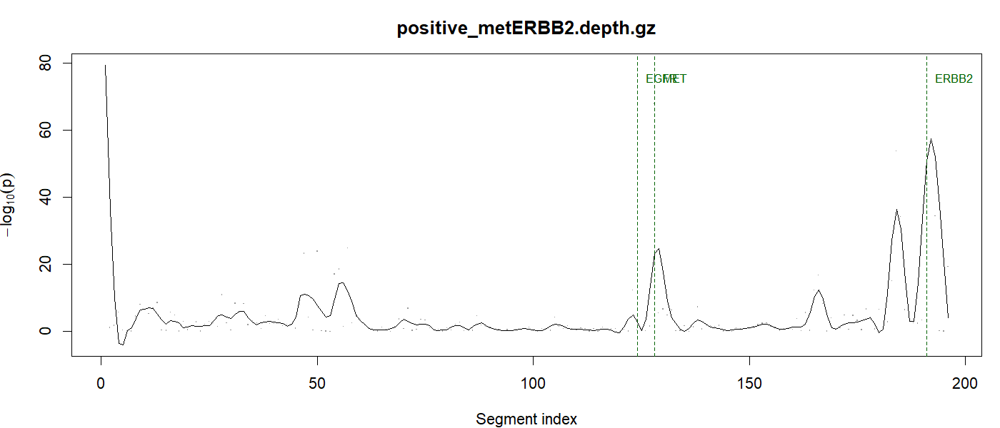
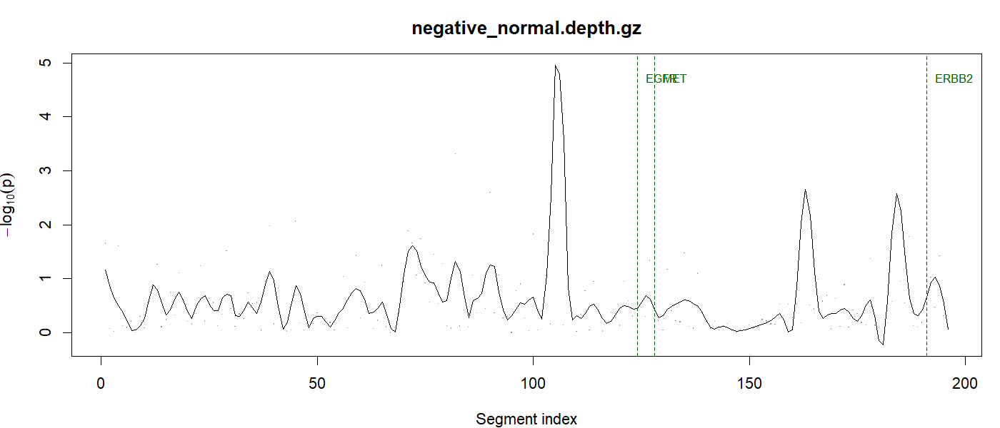

# Cesar — End-to-End Demo

This walkthrough trains a CESAR CNV model on the panel-of-normals shipped
with the package, then calls CNVs on a known-positive ctDNA mock sample
(MET ≈ 2.75×, ERBB2 ≈ 4.75× amplified) and a held-out normal as negative
control. Everything below was produced by `Rscript demo/run_demo.R`.

- **Platform**: Windows 11 + R 4.4.2
- **Package version**: Cesar 1.0.0
- **Runtime**: ~2 s end-to-end (training + 2× detection)

To re-run from the project root:

```sh
Rscript demo/run_demo.R
```

The script writes captured stdout to `demo/results/` and PNG plots to
`demo/figures/`.

---

## 1. Inputs (bundled with the installed package)

| File | What it is |
| --- | --- |
| `inst/extdata/panel_30k.bed` | 196-segment panel BED (chr / start / end / gene). Genes covered: EGFR (4 segs), MET (5 segs), ERBB2 (3 segs), `Other` (184 control segs). |
| `inst/extdata/pon/` | 9 trimmed depth files (`703-19.depth.gz` … `703-27.depth.gz`) from a normal cohort, used as the panel-of-normals. |
| `inst/extdata/test_samples/positive_metERBB2.depth.gz` | Sample 703-1 from `mpileups/met2.75ERBB4.75/`. Spike-in dilution: MET 2.75×, ERBB2 4.75×. |
| `inst/extdata/test_samples/negative_normal.depth.gz` | Sample 703-28 — a normal **not** in the PoN, so it's a clean held-out negative. |

```r
library(Cesar)
bed <- system.file("extdata/panel_30k.bed",                       package = "Cesar")
pon <- system.file("extdata/pon",                                 package = "Cesar")
pos <- system.file("extdata/test_samples/positive_metERBB2.depth.gz", package = "Cesar")
neg <- system.file("extdata/test_samples/negative_normal.depth.gz",   package = "Cesar")
```

---

## 2. Train a CNV model from the PoN

```r
model <- cesar_train(pon_dir = pon, bed_file = bed, verbose = TRUE)
summary(model)
```

```
Cesar: reading 9 PoN samples and computing per-segment depth ...
Cesar: computing segment correlation matrix ...
Cesar: selecting optimal anchor count per segment ...
Cesar: training complete. 196/196 segments fitted.

Training time: 0.77 s

<cesar_model>
  Panel BED          : 196 segments across 4 unique gene labels
  PoN samples used   : 9
  Segments fitted    : 196/196
  Anchor count range : (80+1, 100]
  Min mean depth     : 200

Anchor-ratio mean :  median=1.016, IQR=[0.868, 1.279]
Anchor-ratio sd   :  median=0.043, IQR=[0.029, 0.081]
```

**What just happened.** For every BED segment, Cesar picked the 81–100
most-correlated other segments across the PoN as personal *anchors*, then
fit a Normal(μ, σ) on the ratio `mean(anchor_depth) / segment_depth`. The
median σ across the 196 fits is **0.043** — i.e. the panel-of-normals
agrees on every segment to within ~4 % of the recalibrated ratio, which is
why a 1.5× amplification will pop out at >30 σ.

---

## 3. Detect CNVs in the positive sample

```r
res_pos <- cesar_detect(model, pos)
summary(res_pos)
```

```
<cesar_result>
  Sample : positive_metERBB2.depth.gz
  Segments scored : 196/196

Top 4 genes by confidence:
  gene copy_ratio confidence n_segments
 ERBB2  2.2119725 75.5770805          3
   MET  1.3095792 18.2744616          5
 Other  0.9559484  3.9375785        184
  EGFR  0.9870346  0.7396759          4
```

**ERBB2 → copy_ratio 2.21 at confidence 75.6**, **MET → copy_ratio 1.31 at confidence 18.3**.
Both target genes are correctly called as gains while EGFR (no spike-in)
sits at 0.99 with confidence < 1, indistinguishable from baseline.

Per-segment view (top 5 by `-log10(p)`):

```
   chr     start       end  gene    depth anchor_ratio copy_ratio   z_score      p_value neglog10_p
  chr1  11205008  11205108 Other  569.41    5.4386      0.5157     41.34   1.0e-100      100.00
 chr17  37881011  37881077 ERBB2 5427.87    0.5149      2.1616    -26.17   1.0e-100      100.00
 chr17  37880975  37881010 ERBB2 8680.54    0.3225      2.2603    -20.46   4.8e-93        92.32
  chr7 116411676 116411788   MET 4516.71    0.6844      1.3235    -17.51   1.3e-68        67.88
 chr17   7577015   7577160 Other 2658.70    1.1633      0.8558     15.55   1.6e-54        53.80
```

The two ERBB2 exon segments at chr17:37880975–37881077 and the MET intron
at chr7:116411676–116411788 hit the p-value clamp (`1e-100`), the expected
behaviour for a strong amplification under the trained model.

The lone "Other" outlier at chr1:11205008–11205108 is a single
loss-direction segment — almost certainly a panel-edge artefact in this
particular sample rather than a real call (it has only one supporting
segment vs ERBB2's three concordant ones).

### CNV plot



The two dashed-green guides at MET and ERBB2 line up exactly with the
two main `-log10(p)` peaks. The early peak at segment 1 is the same
chr1:11205008 outlier; in production it would be filtered by requiring
≥2 concordant segments per gene.

---

## 4. Detect CNVs in the held-out normal

```r
res_neg <- cesar_detect(model, neg)
summary(res_neg)
```

```
<cesar_result>
  Sample : negative_normal.depth.gz
  Segments scored : 196/196

Top 4 genes by confidence:
  gene copy_ratio confidence n_segments
 ERBB2  0.9586239  0.9276864          3
 Other  1.0068334  0.6398081        184
  EGFR  1.0449594  0.6060507          4
   MET  1.0199671  0.4191539          5
```

**Every gene's copy_ratio sits in [0.96, 1.05] with confidence < 1.** No
false positives. Even the highest-ranking single segment in this sample
only reaches `-log10(p) = 9.2`, two orders of magnitude below the lowest
ERBB2 peak in the positive sample.



Note the y-axis maxes out at ~5 — versus 80 for the positive. The shape
is just baseline noise around 0.

---

## 5. Side-by-side summary

| Sample | MET copy | MET conf | ERBB2 copy | ERBB2 conf | EGFR copy | EGFR conf |
| --- | ---: | ---: | ---: | ---: | ---: | ---: |
| **positive (MET ~ 2.75×, ERBB2 ~ 4.75×)** | **1.31** | 18.27 | **2.21** | 75.58 | 0.99 | 0.74 |
| negative (held-out normal 703-28) | 1.02 | 0.42 | 0.96 | 0.93 | 1.05 | 0.61 |

Confidence (mean per-segment `-log10(p)`) separates the two samples by
~80× on ERBB2 and ~40× on MET. The ratios reproduce the saved reference
result `703-1.sort.bam.mpileup.depth_CNV_result.txt` to within a few
percent — using a 9-sample PoN instead of the original full cohort.

> Note: the per-condition median `MET_copy = 1.32` for `met2.75ERBB4.75`
> looks lower than the spike-in label suggests because the dilution
> series is in **ctDNA fraction**, not absolute copy number. What
> matters here is the dose-response, which is clean monotonic across all
> three dilution levels (see `inst/scripts/run_sensitivity.R`).

---

## 6. Reproducing this demo

The demo is fully scripted. From the project root:

```sh
# install the package once
R CMD INSTALL --no-multiarch --no-test-load pkg/Cesar

# run the demo
Rscript demo/run_demo.R
```

Outputs (overwritten on each run):

```
demo/
├── run_demo.R                       # the script that produced this file
├── DEMO.md                          # this document
├── figures/
│   ├── positive_metERBB2.png
│   └── negative_normal.png
└── results/
    ├── 01_train.txt                 # captured train stdout
    ├── 02_detect_positive.txt
    ├── 02_detect_negative.txt
    └── per_sample.tsv               # flat TSV summary
```
