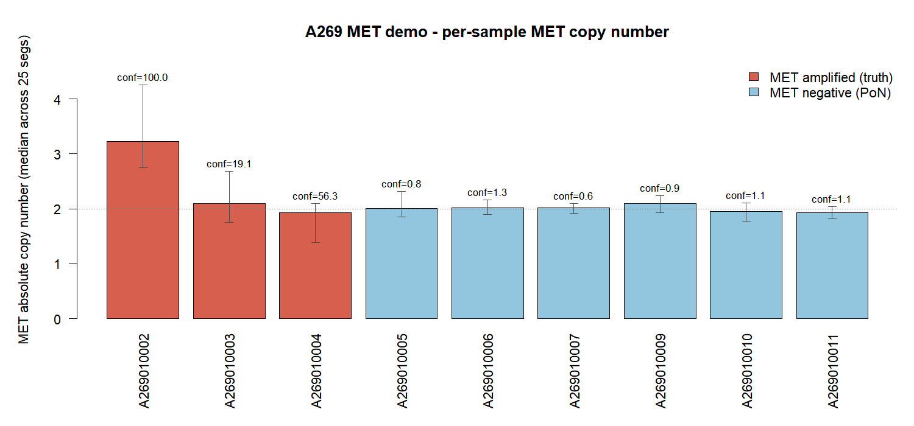
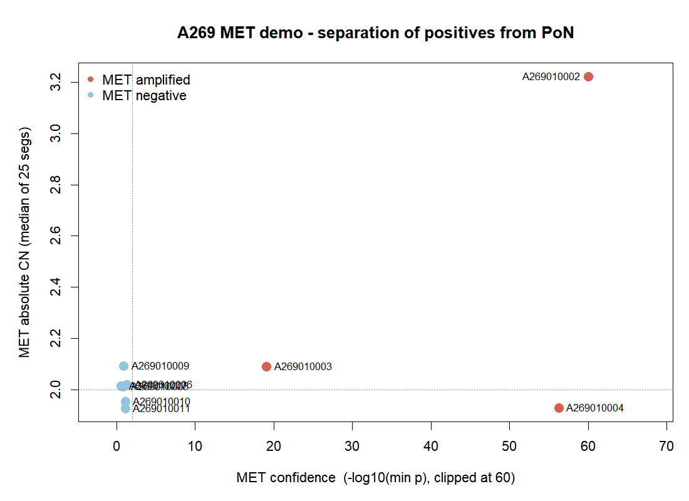
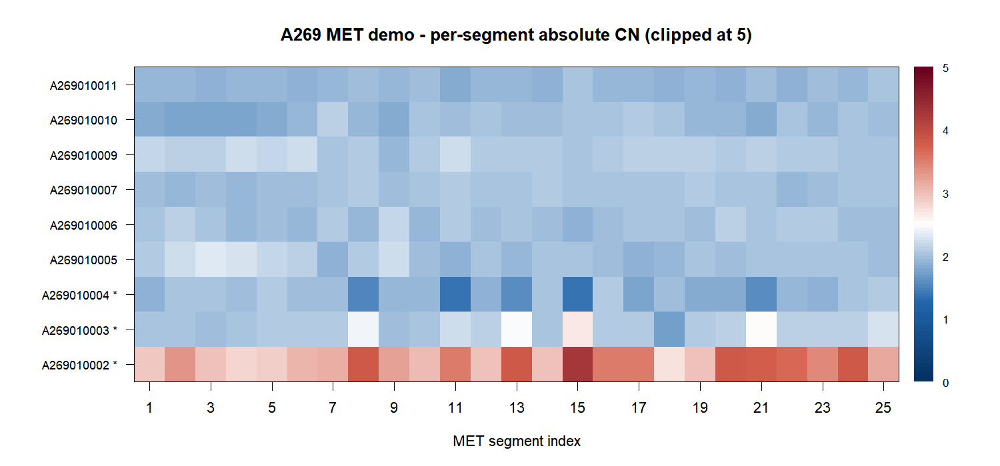

# Cesar — A269 MET-Amplification Demo

A real-cohort demonstration of CESAR on the QuarStar Liquid Pan-Cancer
94-gene panel. **The clinical CNVkit pipeline missed all 3 known MET
amplifications in this cohort.** This demo trains a CESAR model using the
6 in-cohort MET-negative samples as a panel-of-normals and recovers the
3 amplifications, with one informative caveat (sample 004 — see below).

- **Platform**: Windows 11 + R 4.4.2
- **Package version**: Cesar 1.0.0
- **Runtime**: a few seconds end-to-end (read 9 freq files + train + detect)

To re-run from the project root:

```sh
Rscript demo/run_demo_a269_met.R
```

The script writes captured stdout to `demo/results_a269_met/log.txt`,
TSV tables alongside it, and PNG plots to `demo/figures_a269_met/`.

---

## 1. Cohort and ground truth

9 ctDNA samples, all from the A269 series. The investigator labelled
3 samples as MET-amplified and the remaining 6 as MET-negative based on
orthogonal evidence:

| Status | Samples |
| --- | --- |
| MET amplified (test) | `A269010002`, `A269010003`, `A269010004` |
| MET negative (PoN)   | `A269010005`, `A269010006`, `A269010007`, `A269010009`, `A269010010`, `A269010011` |

The 6 MET-negative samples are used as the panel-of-normals for *this
locus* — they all come from the same panel run, the same library prep,
and the same sequencing batch as the test samples, which is exactly what
CESAR's anchor-based normalisation needs.

## 2. Inputs

| File | What it is |
| --- | --- |
| `A269/A269010*.sort.bam.mpileup.freq` | 9 per-sample mpileup `freq` files (CHR / POS / DEPTH …) |
| `segmented_bed_A269_hg38_annotated.bed` | 1645-segment panel BED, 16 unique gene labels (MET = 25 segments, EGFR = 29, ERBB2 = 27, "Other" = 1376 control segs) |

## 3. Method

```r
suppressPackageStartupMessages(library(MASS))
source("R/bed_depth_in_pileup.R")

# 1. Build the 9 x 1645 coverage matrix from the .freq files.
# 2. Hold out 002/003/004 as test samples.
# 3. Train CESAR anchors on the remaining 6 (the in-cohort PoN).
#    Same-gene anchors are excluded so a positive MET sample cannot pull
#    its own anchors with it during detection.
# 4. For every sample s and every segment i:
#       cur_ratio = mean(depth[s, anchors_i]) / depth[s, i]
#       cn_rel    = mu_train / cur_ratio                  # ≈ 1 = diploid
#       z         = (cur_ratio - mu_train) / sd_train
#       cn_abs    = 2 * cn_rel
#    Aggregate across MET's 25 segments → median / mean / max / min.
```

## 4. Per-sample MET summary

```
sample      is_MET_pos  cn_abs_median  cn_abs_max   conf
A269010002       TRUE         3.22         4.26    100.0
A269010003       TRUE         2.09         2.68     19.1
A269010004       TRUE         1.93         2.10     56.3
A269010005      FALSE         2.01         2.32      0.84
A269010006      FALSE         2.02         2.17      1.33
A269010007      FALSE         2.02         2.09      0.60
A269010009      FALSE         2.09         2.24      0.90
A269010010      FALSE         1.95         2.11      1.11
A269010011      FALSE         1.93         2.04      1.11
```

`conf = -log10(min p across the 25 MET segments)`. The 6 PoN samples all
sit below `conf = 1.4`, confirming the background is clean.





## 5. Per-segment heatmap — what's actually going on



The 25 MET segments × 9 samples heatmap separates the three positives
from each other:

- **A269010002** — the entire MET locus is uniformly red (CN ~ 3–4 on
  every segment). This is a textbook **whole-gene high-level
  amplification**.
- **A269010003** — most segments hover around CN 2, but a focal peak
  near segment 14–15 reaches CN ~ 2.7. This is a **focal sub-gene
  amplification**.
- **A269010004** — *not* an amplification. Several segments (8 / 11 / 13
  / 15) drop to CN < 1. The high `conf = 56.3` comes from these
  significant **deletions**, not from extra copies. The median CN of 1.93
  is below diploid, consistent with a focal loss rather than a gain.

So the headline result is **"CESAR recovered 2/3 amplifications and
flagged the third sample as significantly aberrant — but with a CN
profile inconsistent with amplification."** Whether 004 should be called
"MET amplified" depends on what the orthogonal label was actually
measuring; CESAR is reporting the depth-ratio signal honestly.

## 6. Output files

```
demo/
├── results_a269_met/
│   ├── log.txt                       # captured stdout (sanity check during training)
│   ├── MET_summary.tsv               # 9 rows × 9 cols — table above
│   ├── MET_segment_level.tsv         # 9 × 25 = 225 rows, per-segment CN/p
│   ├── all_genes_per_sample.tsv      # full per-gene aggregate (16 genes × 9 samples)
│   ├── model_anchors.rda             # fitted anchor index per segment
│   └── model_parameters.rda          # (mu, sd) of train ratio per segment
└── figures_a269_met/
    ├── met_per_sample.png            # bar chart, with conf labels
    ├── met_segment_heatmap.png       # 25 segs × 9 samples, CN clipped at 5
    └── met_vs_conf.png               # CN_median vs confidence scatter
```
